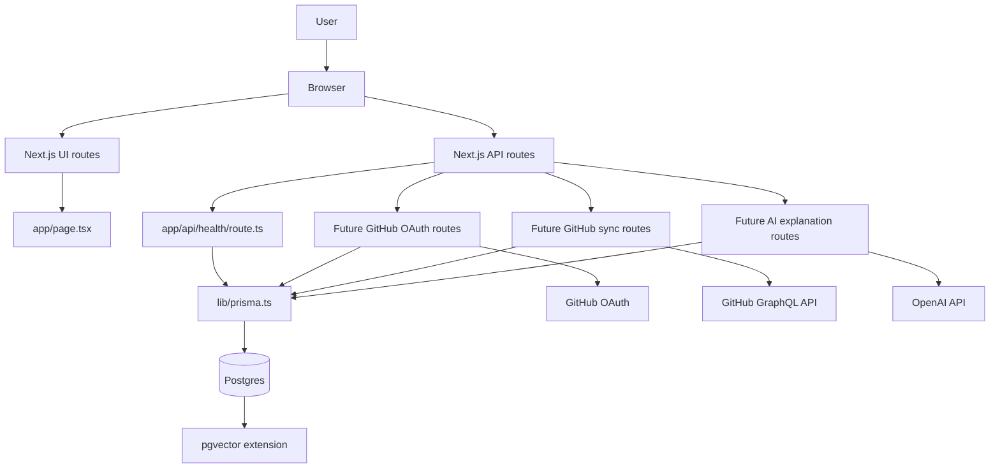
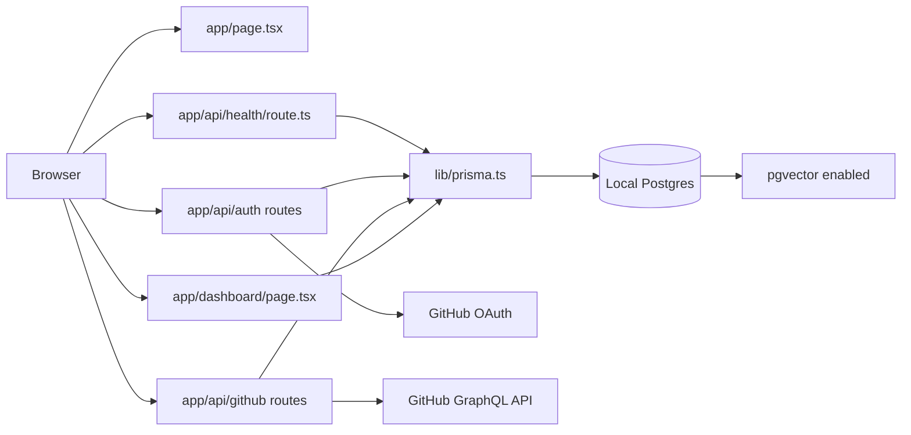
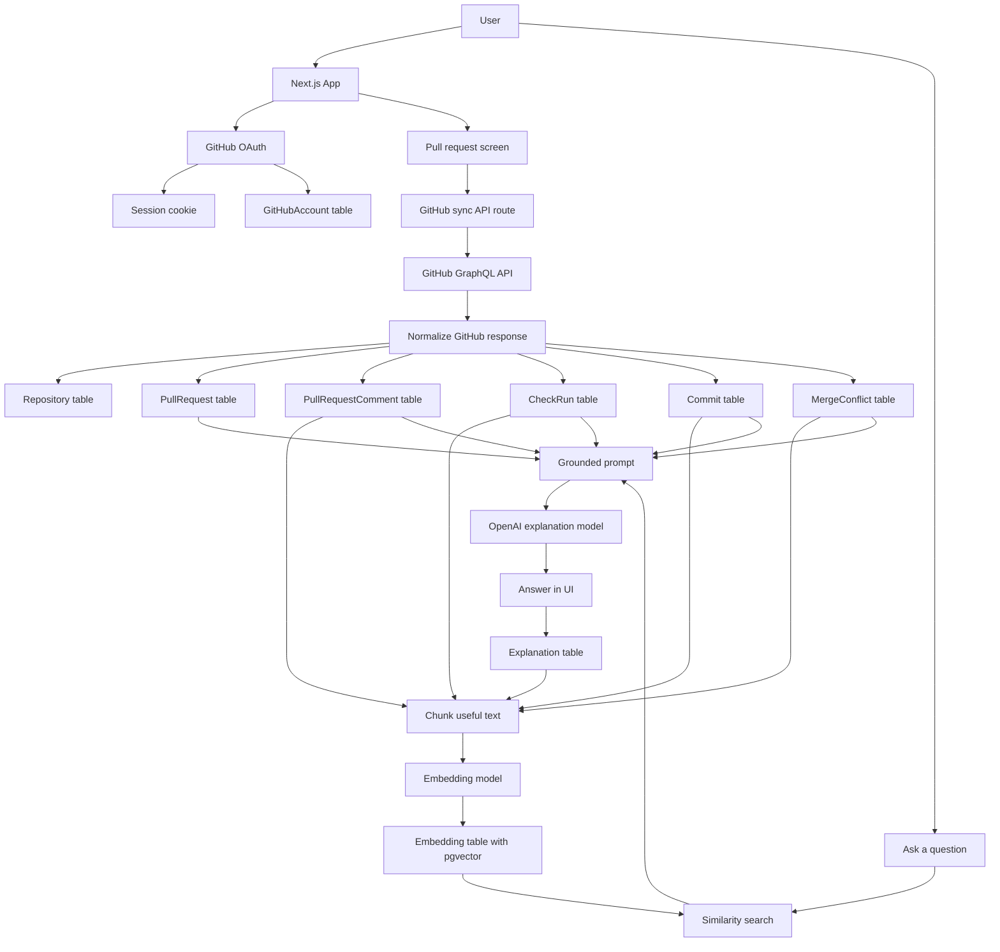
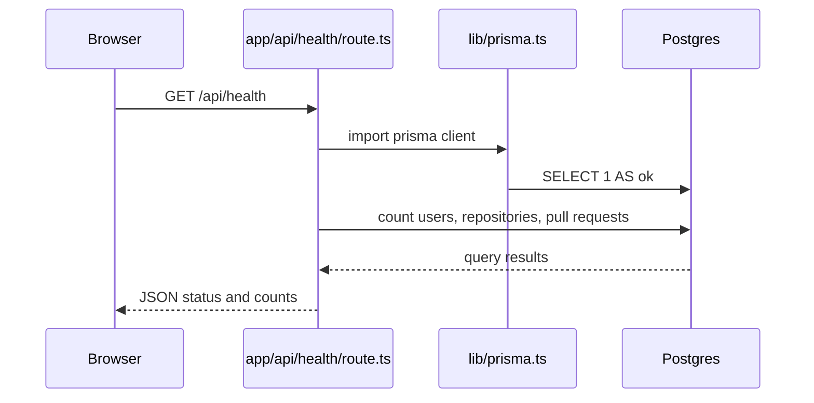
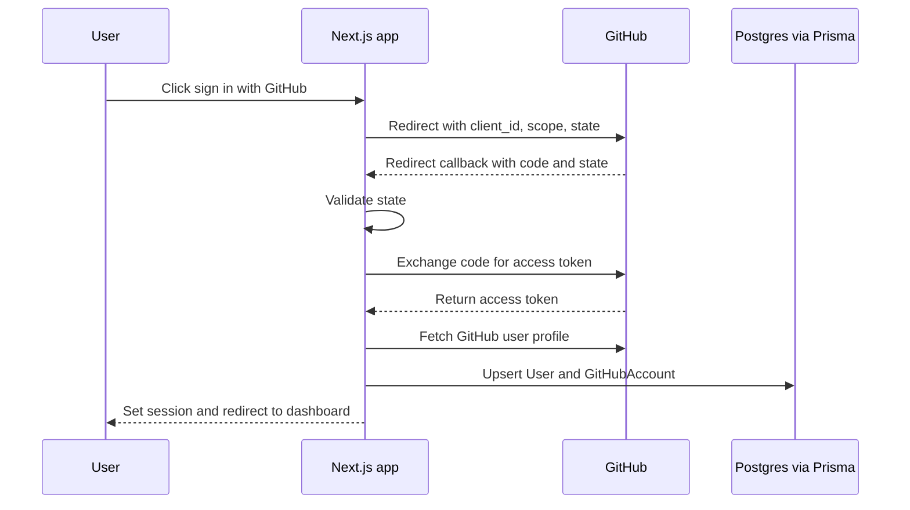
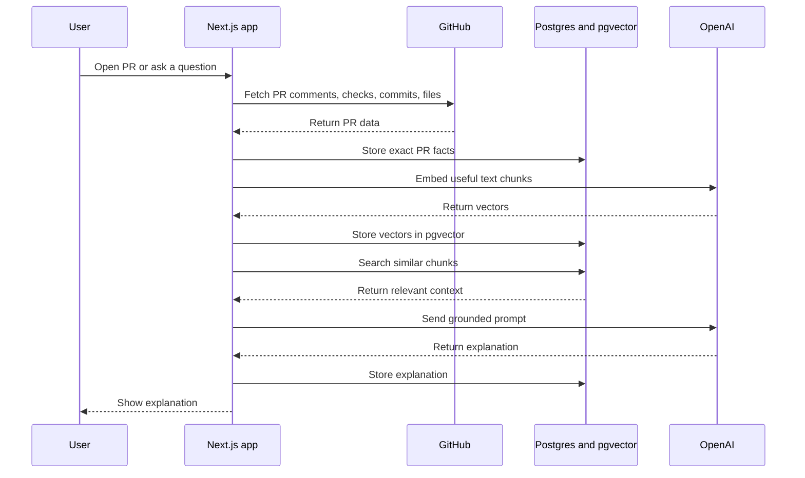

# Application Architecture

GitHub PR Mentor AI is a full-stack Next.js app. Next.js owns the UI and backend routes, Prisma owns typed database access, Postgres stores durable records, pgvector stores searchable embeddings, GitHub provides pull request data, and OpenAI generates explanations.

## System Overview



## Current Architecture

This is what exists right now.



Current behavior:

```txt
GET /
renders the learning homepage.

GET /api/health
checks Prisma can query Postgres.

GET /api/auth/github/start
starts the GitHub OAuth redirect.

GET /api/auth/github/callback
validates state, exchanges code, stores the GitHub account, and creates a session.

GET /api/auth/me
returns the current signed-in user or logged-out state.

POST /api/auth/logout
deletes the current app session.

GET /api/github/viewer
uses the stored GitHub token to fetch the authenticated GitHub viewer.

GET /api/github/repositories
uses the stored GitHub token to fetch recent owner repositories.

GET /api/github/pull-request?owner=OWNER&repo=REPO&number=NUMBER
fetches a PR overview from GitHub and stores the first comments and commits.
```

## Future Architecture

This is the target architecture as the app grows.



## Request Flow: Database Health Check



## Request Flow: Future GitHub OAuth



## Request Flow: Future PR Explanation



## Layer Responsibilities

```txt
Next.js UI
- Screens the user sees
- Routes like /, /dashboard, /pulls/[number]

Next.js API routes
- Backend endpoints
- OAuth callbacks
- GitHub sync
- AI explanation requests

Prisma
- Typed reads and writes
- Database model access
- Migrations through Prisma CLI

Postgres
- Exact durable facts
- Users, repositories, PRs, comments, checks, commits, explanations

pgvector
- Embedding vectors
- Similarity search over meaning

GitHub APIs
- OAuth identity
- Pull request data from GraphQL

OpenAI APIs
- Embeddings for retrieval
- Explanations for user-facing answers
```
