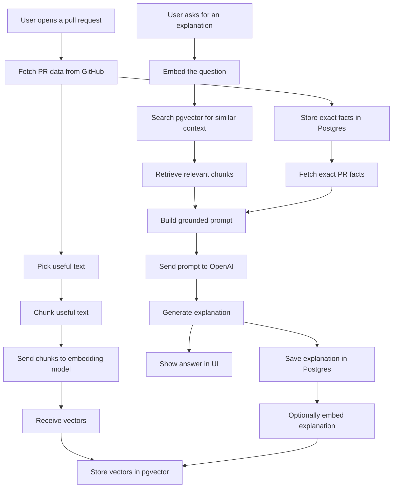
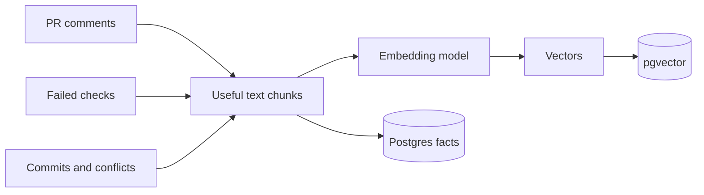
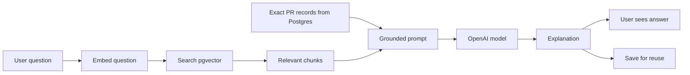

# Lesson 3: AI and RAG Workflow

This app uses AI to explain GitHub pull request activity. The important idea is that we do not want the model to guess. We want to give it real GitHub context, retrieve related history, and then ask it to explain what is happening.

## The Short Version

```txt
GitHub gives us facts.
Postgres stores facts.
Embeddings turn text into searchable meaning.
pgvector finds related meaning.
OpenAI explains the facts in human language.
```

## Core Terms

### LLM

An LLM is a large language model. It reads text and generates text.

In this app, the LLM explains pull request comments, failed checks, commits, and merge conflicts.

### Prompt

A prompt is the instruction and context we send to the model.

Example:

```txt
Explain this failed GitHub check to a junior developer.
Use the PR title, changed files, commits, and error output below.
```

### Context

Context is the information we provide so the model can answer accurately.

For this app, context can include:

- PR title
- review comments
- failed check output
- commit messages
- changed files
- merge conflict snippets
- similar past explanations

### Token

A token is a chunk of text the model reads or writes.

Tokens matter because they affect cost and context limits. More text means more tokens.

```txt
Token = text chunk
```

### Embedding

An embedding is a numeric representation of text meaning.

Example:

```txt
"Expected status 200 but got 401"
```

can become a vector like:

```txt
[0.012, -0.44, 0.91, ...]
```

```txt
Embedding = meaning converted into numbers
```

### Vector

A vector is the actual list of numbers returned by the embedding model.

The flow is:

```txt
text
↓
embedding model
↓
vector
```

### pgvector

pgvector is a Postgres extension that stores and searches vectors.

In this app, normal database rows live in Postgres, while embedding vectors live in pgvector columns.

### Similarity Search

Similarity search finds text with similar meaning, even when the wording is different.

Example:

```txt
"expected 200 but got 401"
```

can match:

```txt
"unauthorized request"
"missing auth token"
"session expired"
```

### RAG

RAG means retrieval-augmented generation.

It means:

```txt
Retrieve useful context first.
Then generate an answer using that context.
```

For this app:

```txt
User asks about a failed check
↓
Search Postgres/pgvector for related PR context
↓
Send current PR data plus retrieved context to OpenAI
↓
Generate a clear explanation
```

### Grounding

Grounding means making the AI answer from real provided evidence.

Good grounded answer:

```txt
This check failed because the log says the request returned 401.
The changed file is auth/session.ts, so inspect token handling there.
```

Weak ungrounded answer:

```txt
This is probably a database issue.
```

### Hallucination

A hallucination is when the model makes something up.

We reduce hallucinations by:

- sending real GitHub data
- retrieving relevant past context
- asking the model to cite the evidence it used
- asking the model to say when it is unsure

### Chunking

Chunking means breaking large text into smaller useful sections.

Example:

```txt
huge CI log
↓
smaller log sections
↓
embed only useful chunks
```

### Metadata

Metadata is extra information saved with embedded text.

Example:

```txt
type: check_run
repo: github-pr-mentor-ai
prNumber: 12
file: auth/session.ts
```

Metadata helps us filter search results before or after similarity search.

## Token vs Embedding

A token is not an embedding.

```txt
Token = a text chunk the model reads or writes
Embedding = a vector that represents text meaning
```

The developer workflow is:

```txt
send text
↓
model tokenizes it internally
↓
embedding model returns a vector
↓
store vector in pgvector
```

As developers, we usually think:

```txt
send text → receive vector
```

We do not usually manually send tokens to the embedding model.

## What We Will Embed

Good candidates:

- PR comments
- failed check summaries
- useful CI log chunks
- commit summaries
- conflict explanations
- AI explanations
- debugging notes

Bad candidates:

- passwords
- GitHub access tokens
- raw secrets
- huge unfiltered logs
- random IDs without useful meaning

## Full Workflow



```txt
1. User opens a pull request.
2. App fetches PR data from GitHub.
3. App stores PR data in Postgres.
4. App chunks useful text.
5. App sends text chunks to an embedding model.
6. Embedding model returns vectors.
7. App stores vectors in pgvector.
8. User asks for an explanation.
9. App retrieves related context with similarity search.
10. App sends the question plus retrieved context to OpenAI.
11. OpenAI generates an explanation.
12. App stores the explanation and may embed it for future retrieval.
```

## Indexing Workflow

Indexing prepares the app memory before the user asks a question.



## Answer Workflow

Answering retrieves useful memory, then asks the model to explain from evidence.



## Tangible Example

Imagine this pull request:

```txt
Repo: github-pr-mentor-ai
PR #12: Add GitHub OAuth callback
Author: Tinotenda
Changed file: app/api/auth/github/callback/route.ts
Failed check: auth-callback.test.ts
Error: Expected status 200, received 401
Review comment: "This callback should validate state before exchanging the code."
```

### 1. User Opens A PR

The user opens PR #12 in the app.

```txt
/github-pr-mentor-ai/pulls/12
```

### 2. App Fetches PR Data From GitHub

The app asks GitHub GraphQL for PR title, author, comments, changed files, commits, failed checks, and review threads.

Example data:

```json
{
  "title": "Add GitHub OAuth callback",
  "comments": [
    "This callback should validate state before exchanging the code."
  ],
  "checkRuns": [
    {
      "name": "auth-callback.test.ts",
      "conclusion": "FAILURE",
      "summary": "Expected status 200, received 401"
    }
  ],
  "files": [
    "app/api/auth/github/callback/route.ts"
  ]
}
```

### 3. App Stores Facts In Postgres

Exact facts go into normal relational tables.

Example `PullRequest` row:

```txt
number: 12
title: Add GitHub OAuth callback
state: OPEN
repository: github-pr-mentor-ai
```

Example `CheckRun` row:

```txt
name: auth-callback.test.ts
conclusion: FAILURE
summary: Expected status 200, received 401
```

Example `PullRequestComment` row:

```txt
body: This callback should validate state before exchanging the code.
path: app/api/auth/github/callback/route.ts
```

### 4. App Chunks Useful Text

Instead of embedding the whole PR blindly, the app creates focused chunks.

```txt
Chunk 1:
Failed check auth-callback.test.ts: Expected status 200, received 401.

Chunk 2:
Review comment on app/api/auth/github/callback/route.ts:
This callback should validate state before exchanging the code.

Chunk 3:
PR title: Add GitHub OAuth callback.
Changed file: app/api/auth/github/callback/route.ts.
```

### 5. App Sends Chunks To An Embedding Model

The app sends each text chunk to the embedding model.

```ts
await openai.embeddings.create({
  model: "text-embedding-3-small",
  input: "Failed check auth-callback.test.ts: Expected status 200, received 401."
});
```

### 6. Embedding Model Returns Vectors

The embedding model returns a vector, which is a list of numbers representing meaning.

```txt
[0.018, -0.203, 0.774, ...]
```

### 7. App Stores Vectors In pgvector

The app stores the original text, the vector, and enough metadata to connect it back to the PR.

```txt
content: Failed check auth-callback.test.ts: Expected status 200, received 401.
embedding: [0.018, -0.203, 0.774, ...]
metadata: check_run, PR #12, repo github-pr-mentor-ai
```

### 8. User Asks A Question

The user asks:

```txt
Why is this PR failing?
```

### 9. App Searches Similar Context

The app embeds the user question, searches pgvector, and retrieves the most relevant chunks.

```txt
Failed check: Expected status 200, received 401.
Review comment: validate state before exchanging the code.
Changed file: app/api/auth/github/callback/route.ts.
```

### 10. App Sends A Grounded Prompt To OpenAI

The app builds a prompt with the question plus retrieved evidence.

```txt
You are explaining a GitHub PR to a junior developer.

Question:
Why is this PR failing?

Relevant PR context:
- PR #12: Add GitHub OAuth callback
- Changed file: app/api/auth/github/callback/route.ts
- Failed check: auth-callback.test.ts
- Error: Expected status 200, received 401
- Review comment: This callback should validate state before exchanging the code.

Explain:
1. What likely failed
2. Why it matters
3. Where to look
4. What to try next
```

### 11. OpenAI Generates An Explanation

The model can now answer from evidence instead of guessing.

```txt
The failing test expected the OAuth callback to succeed with status 200, but it received 401, which usually means the request was rejected as unauthorized.

In this PR, the review comment mentions validating the OAuth state before exchanging the code. That is likely connected. If the callback does not correctly validate or preserve the state value, the app may reject the request before completing login.

Start by checking app/api/auth/github/callback/route.ts. Look for where the route reads the state parameter, compares it with the stored session or cookie value, and handles invalid state. Also confirm the test is setting up the expected state value before calling the callback.
```

### 12. App Stores The Explanation

The app saves the explanation for history, cost tracking, and future retrieval.

```txt
targetType: check_run
summary: OAuth callback test returns 401 instead of 200.
explanation: The route likely rejects the request because state validation is missing or mismatched.
model: gpt-...
```

The app may also embed this explanation, so a future PR with a similar OAuth failure can retrieve it.

## Best Practices

- Do not send secrets to embedding or explanation models.
- Store the original text with the vector so search results remain explainable.
- Store metadata with every embedded chunk.
- Keep chunks small enough to be focused but large enough to preserve meaning.
- Retrieve only the most relevant context before generating an answer.
- Ask the model to explain uncertainty instead of pretending.
- Save model name and token usage with each explanation for cost tracking.
