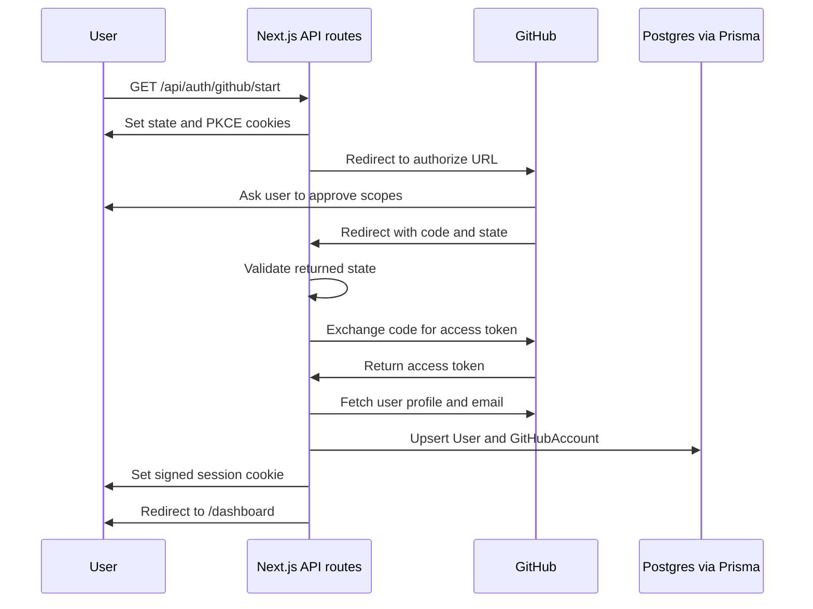

# Lesson 4: GitHub OAuth

This lesson adds the sign-in foundation. The app redirects a user to GitHub, receives a temporary authorization code, exchanges that code for an access token, fetches the GitHub user profile, stores the account in Postgres, and creates a local session.

## Why OAuth Exists

OAuth lets the app access GitHub on behalf of a user without asking for the user's GitHub password.

The app receives a token from GitHub. That token should be treated like a password because it can access GitHub data allowed by the granted scopes.

## OAuth In General

OAuth is a way for one app to access another service without asking for the user's password.

Example:

```txt
GitHub PR Mentor AI wants to read a user's GitHub pull requests.
The app should not ask for the user's GitHub password.
So the app sends the user to GitHub.
GitHub asks the user to approve access.
If the user approves, GitHub gives the app a limited access token.
```

## Main OAuth Roles

```txt
User
The person signing in.

Client/App
Our app: GitHub PR Mentor AI.

Authorization Server
GitHub's login and permission system.

Resource Server
GitHub's API, where repos, PRs, comments, and checks live.

Access Token
The limited key our app uses to call GitHub APIs.
```

## Basic OAuth Flow

```txt
1. User clicks "Sign in with GitHub".
2. App redirects user to GitHub.
3. GitHub asks user to approve access.
4. GitHub redirects back to app with a temporary code.
5. App exchanges code for an access token.
6. App uses access token to call GitHub APIs.
```

In this app:

```txt
/api/auth/github/start
starts the flow.

/api/auth/github/callback
finishes the flow.
```

## Why Not Ask For A Password?

Asking for the user's GitHub password would be dangerous.

Bad design:

```txt
User gives GitHub password to our app.
Our app stores or handles password.
If our app is compromised, the GitHub account is exposed.
```

OAuth design:

```txt
User logs in directly on GitHub.
Our app never sees the password.
GitHub gives our app a limited token.
User can revoke the app later.
```

## Access Token

An access token is a limited-use key.

Our app sends it to GitHub like this:

```http
Authorization: Bearer gho_example_token
```

GitHub checks:

```txt
Who owns this token?
What scopes does this token have?
Should this API request be allowed?
```

## Authorization Code

The authorization code is a short-lived temporary value GitHub sends back to the app.

```txt
GitHub redirects to:
/api/auth/github/callback?code=abc123&state=xyz
```

The code is not the final token. The backend exchanges it for the access token.

```txt
temporary code + client secret + PKCE verifier
↓
access token
```

That exchange happens server-side so the client secret stays private.

## Redirect URI

The redirect URI is where GitHub sends the user after approval.

For local development:

```txt
http://localhost:3000/api/auth/github/callback
```

GitHub only redirects to approved callback URLs. This helps prevent attackers from stealing login responses.

## OAuth Token vs App Session

This is one of the most important distinctions.

OAuth token:

```txt
Lets our app talk to GitHub.
Stored server-side.
Used for GitHub API calls.
```

App session:

```txt
Lets the browser stay logged into our app.
Stored as a cookie.
Used by our app to recognize the user.
```

After OAuth succeeds, we create our own session.

```txt
GitHub gives access token.
↓
App saves encrypted token in Postgres.
↓
App creates session cookie.
↓
Browser is now logged into our app.
```

OAuth answers:

```txt
Can this app access GitHub for this user?
```

Session answers:

```txt
Is this browser logged into our app?
```

## Routes Added

```txt
GET /api/auth/github/start
starts the GitHub OAuth flow

GET /auth/setup
explains which local GitHub OAuth settings are missing

GET /api/auth/github/callback
handles GitHub's redirect back to the app

GET /api/auth/me
returns the current signed-in user, if there is one

POST /api/auth/logout
deletes the local app session

GET /dashboard
shows the signed-in learning checkpoint
```

## OAuth Flow



## Security Pieces

### State

`state` is a random value used to protect against cross-site request forgery. The app stores it in an HTTP-only cookie before redirecting to GitHub. When GitHub redirects back, the app compares the returned `state` with the cookie.

If the values do not match, the app rejects the login.

### PKCE

PKCE adds another proof step to the code exchange.

The app creates:

```txt
code_verifier: secret random string stored in a cookie
code_challenge: SHA-256 hash sent to GitHub
```

During callback, the app sends the original `code_verifier` when exchanging the temporary code for an access token.

### HTTP-Only Cookies

The browser stores session and OAuth cookies, but JavaScript in the browser cannot read them. This lowers the risk from cross-site scripting bugs.

### Token Encryption

The GitHub access token is encrypted before being stored in the `GitHubAccount` table.

The database stores:

```txt
accessTokenCiphertext
```

not:

```txt
accessToken
```

## Environment Variables

Copy `.env.example` to `.env`, then fill in:

```txt
APP_URL="http://localhost:3000"
SESSION_SECRET=""
TOKEN_ENCRYPTION_KEY=""
GITHUB_CLIENT_ID=""
GITHUB_CLIENT_SECRET=""
GITHUB_OAUTH_REDIRECT_URI="http://localhost:3000/api/auth/github/callback"
GITHUB_OAUTH_SCOPES="read:user user:email"
```

Generate local secrets:

```bash
openssl rand -base64 32
openssl rand -base64 32
```

Use one value for `SESSION_SECRET` and the other for `TOKEN_ENCRYPTION_KEY`.

## GitHub OAuth App Setup

Create an OAuth app in GitHub developer settings.

Use:

```txt
Homepage URL:
http://localhost:3000

Authorization callback URL:
http://localhost:3000/api/auth/github/callback
```

After GitHub creates the app, copy the Client ID and Client Secret into `.env`.

## Scopes

This lesson starts with:

```txt
read:user user:email
```

That is enough to identify the user and read verified email addresses. Later, repository access choices matter:

```txt
public_repo
allows access related to public repositories

repo
allows broad access to private repositories too
```

For a portfolio learning app, start small and ask for broader access only when the feature needs it.

## Common OAuth Mistakes

```txt
Forgetting to validate state.
Putting the client secret in frontend code.
Requesting too many scopes too early.
Storing access tokens as plain text.
Not matching the callback URL exactly.
Confusing the GitHub token with the app session cookie.
```

## Test Without GitHub Credentials

These checks prove the code compiles and the logged-out state works:

```bash
npm run db:up
npm run db:migrate
npm run db:generate
npm run test
npm run typecheck
npm run build
npm run dev
curl http://localhost:3000/api/auth/me
```

Expected logged-out result:

```json
{
  "authenticated": false,
  "user": null
}
```

If `/api/auth/github/start` redirects to `/auth/setup`, the code is working but `.env` is missing real GitHub OAuth credentials.

## What This Enables Next

After sign-in works, the next lesson can use the stored GitHub token to call GitHub GraphQL and load pull request data.
