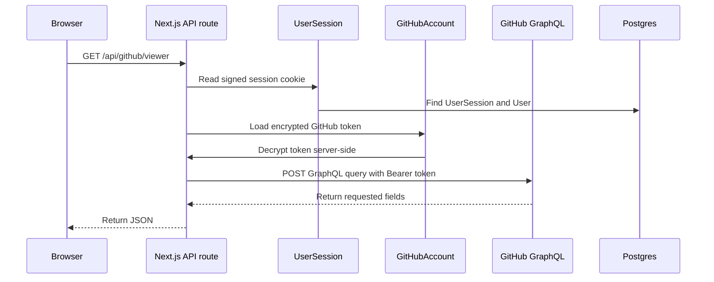

# Lesson 5: GitHub GraphQL Foundation

This lesson uses the GitHub OAuth token we saved in Lesson 4 to make authenticated GitHub GraphQL requests.

## Why GraphQL

GitHub's REST API has many endpoints. GitHub's GraphQL API uses one endpoint:

```txt
https://api.github.com/graphql
```

The app sends a query that lists exactly which fields it wants back.

That is useful for pull request analysis because one PR screen may need data from several GitHub concepts:

- repository
- pull request
- comments
- review threads
- commits
- changed files
- rate limit info

## Routes Added

```txt
GET /api/github/viewer
returns the GitHub user attached to the current OAuth token.

GET /api/github/repositories
returns recent owner repositories and their open PRs.

GET /api/github/pull-request?owner=OWNER&repo=REPO&number=NUMBER
fetches one PR overview, stores the repository, PR, comments, and commits in Postgres, and returns the fetched data.
```

## Request Flow



## Files Added

```txt
lib/github/token.ts
loads and decrypts the user's stored GitHub OAuth token.

lib/github/client.ts
creates the authenticated GitHub GraphQL client.

lib/github/queries.ts
stores GraphQL query strings.

lib/github/schemas.ts
validates GitHub responses with Zod.

lib/github/request.ts
parses safe query parameters from route URLs.

lib/github/sync-pull-request.ts
stores a fetched PR overview in Postgres.
```

## Important Security Rule

The browser never receives the GitHub access token.

```txt
Browser
↓
asks our backend route
↓
backend decrypts token
↓
backend calls GitHub
↓
backend returns safe JSON
```

This keeps the token server-side.

## GraphQL Query Shape

GraphQL lets us ask for nested fields.

Example:

```graphql
query ViewerForPrMentor {
  viewer {
    login
    name
    avatarUrl
    url
  }
  rateLimit {
    cost
    remaining
    resetAt
  }
}
```

The app sends this query to GitHub with:

```http
Authorization: Bearer <github-access-token>
```

## Why Zod Validation

GitHub returns JSON from outside our codebase. We validate it before trusting its shape.

```txt
External API response
↓
Zod schema
↓
Typed app data
```

This helps catch broken assumptions early.

## How To Test In The Browser Console

After signing in with GitHub, open the browser console and run:

```js
await fetch("/api/github/viewer").then((res) => res.json())
```

Then:

```js
await fetch("/api/github/repositories").then((res) => res.json())
```

For a specific PR:

```js
await fetch("/api/github/pull-request?owner=TinotendaMuponda&repo=github-pr-mentor-ai&number=1").then((res) => res.json())
```

Replace the owner, repo, and number with a real pull request.

## Scope Note

For public repository PR data, the OAuth app should request:

```txt
read:user user:email public_repo
```

For private repositories, GitHub requires broader repository access. We should only request that when the feature genuinely needs it.

## What This Enables Next

The next lesson can transform fetched PR data into AI-ready context:

```txt
GitHub PR data
↓
Normalize
↓
Chunk useful text
↓
Embed chunks
↓
Retrieve relevant context
↓
Ask OpenAI for an explanation
```
